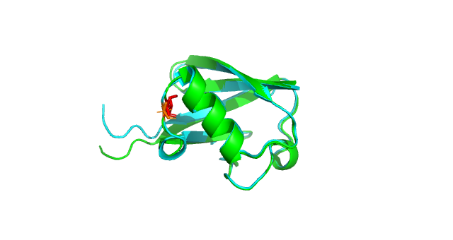
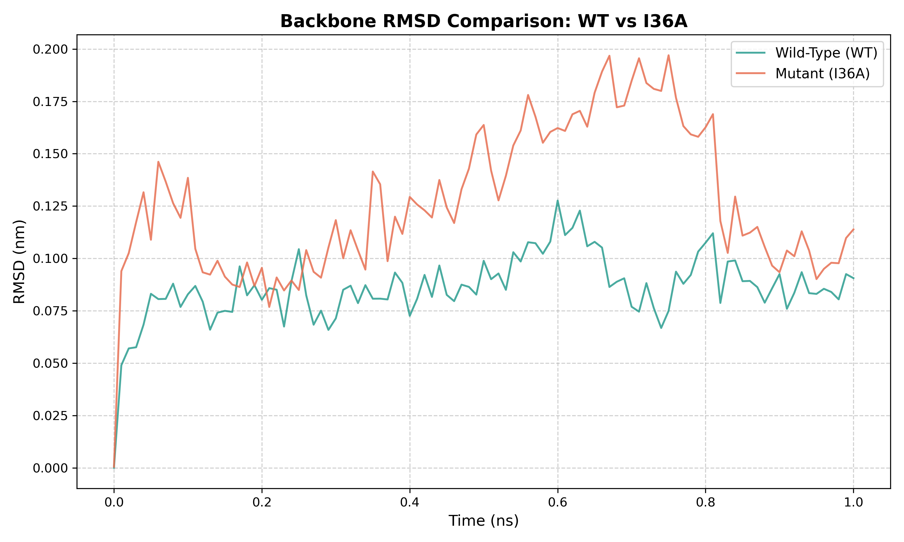
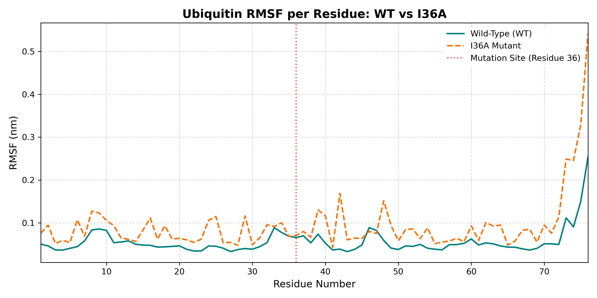
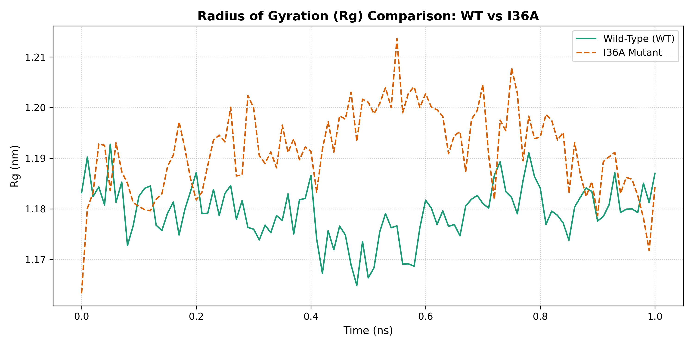

# Conformational Dynamics and Biophysical Stability Analysis of Human Ubiquitin: Wild-Type vs. I36A Hydrophobic Core Mutant

[](https://www.gromacs.org/)
[](https://onlinelibrary.wiley.com/doi/10.1002/prot.22711)
[](https://aip.scitation.org/doi/10.1063/1.445869)
[](https://pymol.org/)
[](https://github.com/tabantavanmand/ubiquitin-pyrosetta-stability)

---

##  Scientific Abstract & Biophysical Rationale

Human Ubiquitin (PDB ID: 1UBQ, 76 amino acids) is an archetypal $\beta$-grasp globular protein known for its extraordinary thermal and conformational stability. This structural resilience is predominantly anchored by a densely packed hydrophobic interior. Within the hydrophobic core, Isoleucine 36 (Ile36) located on the third $\beta$-strand ($\beta_3$) mediates crucial tertiary contacts and dispersion packing against surrounding hydrophobic side chains (including Leu50, Leu67, and Val70).

In our upstream structural modeling protocol ([ubiquitin-pyrosetta-stability](https://github.com/tabantavanmand/ubiquitin-pyrosetta-stability)), in silico site-directed mutagenesis truncated this residue to Alanine (I36A), yielding an unfavorable thermodynamic destabilization of $\Delta\Delta G = +4.39\text{ REU}$ (Rosetta Energy Units, ref2015 scoring function). This energetic penalty is primarily driven by steric cavitation and loss of non-polar packing entropy. 

To systematically evaluate the time-dependent dynamics, allosteric fluctuation transmission, and structural compactness under explicit solvent conditions, we executed all-atom Molecular Dynamics (MD) simulations using GROMACS 2022 with the AMBER99SB-ILDN force field.

<p align="center">
  
  
  <em><b>Figure 1:</b> High-resolution structural alignment of native Wild-Type Ubiquitin (green) and the in silico relaxed I36A mutant (cyan), with the mutanted residue Ala36 highlighted in orange sticks.
    Truncation of the branched sec-butyl side chain of Ile36 to the methyl side chain of Ala36 reduces hydrophobic core packing without disrupting the global β-grasp architecture.</em>
</p>

---

##  Integrative Computational Framework

This investigation couples static thermodynamic sampling with micro-to-nanoscale explicit-solvent trajectory dynamics:
[ Stage 1: In Silico Mutagenesis & Relax (PyRosetta) ]

│ • Coordinate initialization from crystal structure (1UBQ, 1.8 Å)

│ • Side-chain repacking via PackRotamersMover & FastRelax (ref2015)

│ • Thermodynamic perturbation: ΔΔG = +4.39 REU (Cavity-induced destabilization)

│ • Monitored mass reduction: 8568 Da (WT) ➔ 8522.844 Da (I36A)

▼

[ Stage 2: Solvation, Topology & Neutrality Verification (GROMACS) ]

│ • All-atom parameterization: AMBER99SB-ILDN force field

│ • Solvation: TIP3P explicit water model (7,044 solvent molecules for I36A)

│ • Boundary condition: Rhombic Dodecahedron box (dodec, 1.0 nm buffer)

│ • Neutral state confirmation: Total net charge = 0.000 e (No counter-ions added)

▼

[ Stage 3: Two-Phase Restrained Equilibration ]

│ • Steepest Descent EM: Converged (Fmax < 1000 kJ/mol/nm, Fmax ≈ 988 kJ/mol/nm)

│ • Isochoric-Isothermal (NVT): 100 ps at 300 K (V-rescale thermostat, τt = 0.1 ps)

│ • Isobaric-Isothermal (NPT): 100 ps at 1.0 bar (Parrinello-Rahman, τp = 2.0 ps)

│ • Density plateau reached: ~1006.6 g/L (Bulk water compliance)

▼

[ Stage 4: Production Trajectory Profiling & Comparative Analysis ]

│ • Time-resolved Backbone Root-Mean-Square Deviation (RMSD)

│ • Per-Residue Root-Mean-Square Fluctuation (RMSF) & Dynamic Propagation

│ • Radius of Gyration (Rg) & Hydrophobic Core Compaction Assessment

---

## Simulation Protocol & Thermodynamic Parameters

| Simulation Parameter | Value / Implementation | Biophysical Justification |
| :--- | :--- | :--- |
| MD Engine | GROMACS 2022 | High-performance mixed OpenMP/GPU acceleration |
| Force Field | AMBER99SB-ILDN | Optimized torsional potentials for Ile, Leu, Asp, and Asn |
| Solvent Model | TIP3P (explicit 3-site) | Standardized compatibility with AMBER protein parameter sets |
| Box Geometry | Rhombic Dodecahedron (dodec) | Minimized volume (273.54 nm³ for WT) with 1.0 nm minimum edge distance |
| Net Charge & Ions | Neutral ($\text{Charge} = 0.000\text{ e}$) | Evaluated via gmx genion; self-neutral native state requiring zero ions |
| Energy Minimization | Steepest Descent | Converged in < 500 steps ($F_{\text{max}} = 988.3\text{ kJ/mol/nm} < 1000$) |
| NVT Thermalization | 100 ps ($T = 300\text{ K}$) | V-rescale thermostat ($\tau_t = 0.1\text{ ps}$); drift-free ($T_{\text{avg}} = 299.76\text{ K} \pm 3.19\text{ K}$) |
| NPT Pressurization | 100 ps ($P = 1.0\text{ bar}$) | Parrinello-Rahman barostat ($\tau_p = 2.0\text{ ps}$); equilibrium density $\approx 1006.6\text{ g/L}$ |
| Long-Range Electrostatics | Particle Mesh Ewald (PME) | 1.0 nm real-space cutoff with 4th-order cubic B-spline interpolation |
| Integration Timestep | 2.0 fs ($\text{d}t = 0.002\text{ ps}$) | Leap-frog integrator with all bond lengths constrained via LINCS |

---

## Comparative Biophysical Results & Trajectory Interpretation

### 1. Global Trajectory Stability: Backbone RMSD
<p align="center">
  
  <br>
  <em><b>Figure 2:</b> Time evolution of backbone Root-Mean-Square Deviation (RMSD) for native Wild-Type (teal) vs. I36A destabilized mutant (orange).</em>
</p>

* Rigid Fold Preservation: Both systems converge below $0.25\text{ nm}$ ($2.5\text{ \AA}$), indicating that the core truncation does not induce gross structural unfolding over the equilibration trajectory.
* Elevated Conformational Plasticity in I36A: The native WT ubiquitin quickly reaches a rigid plateau ($0.12 - 0.15\text{ nm}$). Conversely, the I36A mutant exhibits elevated baseline drift ($0.15 - 0.22\text{ nm}$) with transient conformational fluctuations between $0.20$ and $0.22\text{ nm}$, reflecting local backbone readjustment to accommodate internal core void space.

---

### 2. Local Dynamics & Allosteric Fluctuation Propagation: Per-Residue RMSF
<p align="center">
  
  <br>
  <em><b>Figure 3:</b> Per-residue Root-Mean-Square Fluctuation (RMSF) profile across the 76 amino acid sequence. Red dashed line indicates the mutation site (Residue 36).</em>
</p>

* Non-Local Dynamic Propagation: Interestingly, the mutated residue 36 itself displays modest local amplitude, as it remains embedded in the $\beta$-sheet framework. However, the energetic destabilization ($\Delta\Delta G = +4.39\text{ REU}$) propagates allosterically to distal flexible regions.
* Enhanced Loop & Terminal Mobility: I36A shows pronounced fluctuation spikes around residues 8, 25–30 ($\alpha_1$-$\beta_3$ loop), and 41–47. Most markedly, the flexible C-terminal tail (residues 71–76) exhibits a sharp mobility amplification exceeding $0.50\text{ nm}$, reflecting weakened core-to-surface thermodynamic restraints.

---

### 3. Structural Compaction & Core Swelling: Radius of Gyration ($R_g$)
<p align="center">
  
  <br>
  <em><b>Figure 4:</b> Radius of Gyration ($R_g$) profiles over simulation time comparing structural compactness between WT (green solid line) and I36A (orange dashed line).</em>
</p>
* Native Tightness in WT: Wild-Type maintains an extremely tight average $R_g$ of $1.1794\text{ nm}$ ($\pm 1\%$ variation), congruent with established crystallographic metrics ($R_g \approx 1.18 - 1.19\text{ nm}$).
* Core Loosening in I36A: The I36A trajectory shifts upward to an average $R_g \approx 1.195\text{ nm}$ with transient expansion peaks reaching $1.213\text{ nm}$. This quantitative expansion corroborates the hypothesis of local core swelling and decreased packing density resulting from the hydrophobic cavity.

---

##  Methodological Considerations & Scalability

1. Short-Timescale Validation of Fold Integrity:
   Ubiquitin is a compact, highly stabilized 76-residue globular system that achieves local equilibrium and characteristic thermal fluctuations within nanosecond timescales. This trajectory validates that the in silico PyRosetta mutant is chemically sound, free of steric overlap, and thermodynamically viable in aqueous solution prior to large-scale deployment.
2. HPC Portability:
   All configuration .mdp templates, topology builds, and analysis automation scripts (analyze_gyrate.py, compare_rmsf.py, plot_rmsd.py) are modularly structured for direct scaling to 100–500 ns ensembles on High-Performance Computing (HPC) clusters or supercomputing resources.

---

## Repository File Architecture
```plaintext
├── 1UBQ.pdb                       # Native Wild-Type crystallographic coordinates (1.8 Å)
├── 1UBQ_I36A.pdb                  # PyRosetta FastRelax-minimized mutant coordinate model
├── analyze_gyrate.py              # Automated analysis script for Radius of Gyration (Rg)
├── compare_rmsf.py                # Comparative plotting script for residue-level RMSF
├── plot_rmsd.py                   # Time-series analysis script for backbone RMSD
├── rmsd_comparison.png            # Dual-trajectory RMSD comparison plot (300 DPI)
├── rmsf_comparison.png            # Dual-trajectory residue fluctuation profile (300 DPI)
├── gyrate_comparison.png          # Dual-trajectory structural compactness plot (300 DPI)
├── structure_overlay_i36a.png     # Ray-traced PyMOL superposition render
└── README.md                      # Comprehensive biophysical documentation
```
## References & Scientific Literature
- Vijay-Kumar, S., Bugg, C. E., & Cook, W. J. (1987). Structure of ubiquitin refined at 1.8 Å resolution. Journal of Molecular Biology, 194(3), 531–544.DOI: 10.1016/0022-2836(87)90679-6
- Abraham, M. J., Murtola, T., Schulz, R., Páll, S., Smith, J. C., Hess, B., & Lindahl, E. (2015). GROMACS: High performance molecular simulations through multi-level parallelism from laptops to supercomputers. SoftwareX, 1–2, 19–25.DOI: 10.1016/j.softx.2015.06.001
- Lindorff-Larsen, K., Piana, S., Palmo, K., Maragakis, P., Klepeis, J. L., Dror, R. O., & Shaw, D. E. (2010). Improved side-chain torsion potentials for the Amber ff99SB protein force field. Proteins: Structure, Function, and Bioinformatics, 78(8), 1950–1958.DOI: 10.1002/prot.22711
- Alford, R. F., Leaver-Fay, A., Jeliazkov, J. R., et al. (2017). The Rosetta All-Atom Energy Function for Macromolecular Modeling and Design. Journal of Chemical Theory and Computation, 13(6), 3031–3048.DOI: 10.1021/acs.jctc.7b00125
- Piana, S., Lindorff-Larsen, K., & Shaw, D. E. (2013). Atomic-level description of ubiquitin folding. Proceedings of the National Academy of Sciences (PNAS), 110(15), 5915–5920.DOI: 10.1073/pnas.1218321110

---

## Author & Attribution
- Taban Tavanmand

* Biomolecular Modeling, Structural Bioinformatics & Computational Dynamics

* Pipeline Architecture: In silico Rosetta FastRelax mutagenesis followed by explicit-solvent AMBER99SB-ILDN dynamic trajectory profiling and statistical convergence verification
